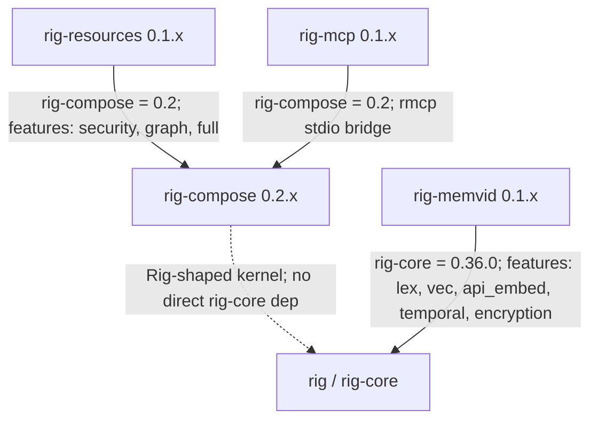

# rig-compose

Composable agent kernel: stateless skills, transport-agnostic tools, registry-driven agents, signal-routing coordinator. Companion crate for rig.

[](https://crates.io/crates/rig-compose)
[](https://docs.rs/rig-compose)
[](LICENSE-MIT)

## Overview

`rig-compose` is a domain-neutral composition layer for Rig-shaped agent systems. It provides the kernel traits and data structures for stateless skills, side-effectful tools, shared registries, generic agents, deterministic signal routing, workflows, in-process agent delegation, and optional YAML manifest loading.

The crate does not call an LLM itself and does not depend on `rig-core`; instead it defines the small tool and skill surfaces that companion crates such as `rig-mcp` and `rig-resources` plug into.

## Why it exists

Rig supplies provider-agnostic model, embedding, vector-store, and tool traits. `rig-compose` fills a different gap: it organizes domain skills and tools into repeatable agent workflows without forcing those workflows to know whether a tool is local, delegated to another in-process agent, or surfaced through MCP.

This keeps downstream systems from reimplementing the same coordination pieces: `Skill`, `Tool`, `ToolRegistry`, `SkillRegistry`, `GenericAgent`, `CoordinatorAgent`, `DelegateTool`, and the budget guards used to meter finite work.

## Status

- Crate version: `0.2.0`.
- Rust edition: 2024.
- MSRV: 1.88.
- Runtime stance: runtime-agnostic library; `tokio` is used only as a dev-dependency for tests and examples.
- Current Unreleased work adds the `budget` module, drop-safe `TokenReservation` refunds, `KernelError::ToolNotApplicable` for soft tool failures, provider-neutral tool-call normalization/dispatch helpers, dispatch hooks, provider-neutral context packing primitives, and bounded tool-result envelopes.

The crate-local maturity plan lives in [ROADMAP.md](ROADMAP.md). Cross-crate
coordination lives in
[`rig-contributions/docs/roadmap.md`](../rig-contributions/docs/roadmap.md).

## Feature flags

| Feature | Default | Enables | Checked by `just check` |
| --- | --- | --- | --- |
| none | yes | Core agent, skill, tool, registry, workflow, delegate, coordinator, context, instruction, and budget APIs. | `cargo clippy --all-targets`, `cargo test --all-targets` |
| `manifest` | no | YAML-backed portable agent manifest types and materialization helpers from [src/manifest.rs](src/manifest.rs). Pulls `serde_yaml`. | `cargo clippy --all-targets --features manifest`, `cargo test --all-targets --features manifest`, docs and examples with all features |

## Key Types

- [src/skill.rs](src/skill.rs): `Skill`, `SkillId`, and `SkillOutcome`. Skills are stateless and decide whether they apply to an `InvestigationContext`.
- [src/tool.rs](src/tool.rs): `Tool`, `ToolSchema`, `ToolName`, `LocalTool`, `ToolResultEnvelope`, and `ToolResultEnvelopeConfig`. Tools are the side-effectful async boundary; envelopes provide deterministic bounding metadata for large tool results.
- [src/registry.rs](src/registry.rs): `ToolRegistry`, `SkillRegistry`, and `KernelError`. Registries hold shared tools and skills; `ToolRegistry::scoped` produces per-agent tool views.
- [src/agent.rs](src/agent.rs): `Agent`, `AgentId`, `AgentStepResult`, `GenericAgent`, and `GenericAgentBuilder`. Generic agents run registered skill chains over mutable investigation context.
- [src/context.rs](src/context.rs): `InvestigationContext`, `Signal`, `Evidence`, and `NextAction` for skill-chain state, plus `ContextItem`, `ContextPack`, `ContextPackConfig`, and `ContextSourceKind` for provider-neutral context-window planning.
- [src/delegate.rs](src/delegate.rs): `DelegateExecutor`, `DelegateRegistry`, `DelegateTool`, `DelegateName`, and `InProcessAgentDelegate`. This is the model-driven agent-to-agent delegation path.
- [src/coordinator.rs](src/coordinator.rs): `CoordinatorAgent`, `CoordinatorBuilder`, and `RoutingRule`. This is deterministic first-match routing for fixed topologies.
- [src/budget.rs](src/budget.rs): `BudgetGuard`, `TokenBudget`, `AtomicBudget`, `AtomicTokenBudget`, `TokenReservation`, `TokenRefund`, and `BudgetError`. These meter rows, dispatch slots, and prompt-token reservations.
- [src/normalizer.rs](src/normalizer.rs): `ToolCallNormalizer`, `LfmNormalizer`, `StructuredToolCallNormalizer`, `ToolInvocation`, and `dispatch_tool_invocations`. These normalize LFM/MLX text markers, OpenAI Responses `function_call` output, and OpenAI Chat Completions `tool_calls` into the same dispatchable shape.
- [src/workflow.rs](src/workflow.rs): `Workflow`, the async workflow composition trait.
- [src/instructions.rs](src/instructions.rs): `Instructions`, a serializable instruction bundle with examples, response schema, and metadata.
- [src/manifest.rs](src/manifest.rs): `AgentManifest`, `ModelSpec`, `ToolSpec`, `DelegateSpec`, and materialization helpers, gated behind `manifest`.

The crate-level architecture rule is simple: `Skill` is pure decision logic, `Tool` is the side-effect boundary, registries own lookup, and agents compose registered pieces without hard-coding concrete implementations.

## Integration With Rig

`rig-compose` does not pin `rig-core` in [Cargo.toml](Cargo.toml). It is intentionally Rig-shaped rather than Rig-bound: other crates can adapt Rig tools, MCP tools, local closures, or in-process delegates into the same `Tool` and `Skill` flow.

The main companion integration points are:

- `rig-mcp` implements remote MCP access by adapting MCP endpoints into `rig_compose::Tool` values.
- `rig-resources` provides reusable skills and tools that implement `rig-compose` traits.
- Downstream systems can use `BudgetGuard` and `TokenBudget` to enforce compute budgets around agent dispatch and LLM token use.

## Usage

The minimal runnable example is [examples/basic_agent.rs](examples/basic_agent.rs). It registers one stateless skill, builds a `GenericAgent`, and runs that agent against an `InvestigationContext`.

```rust,no_run
use std::sync::Arc;

use async_trait::async_trait;
use rig_compose::{
    Agent, GenericAgent, InvestigationContext, KernelError, Skill, SkillOutcome, SkillRegistry,
    ToolRegistry,
};

struct KeywordSkill;

#[async_trait]
impl Skill for KeywordSkill {
    fn id(&self) -> &str {
        "example.keyword"
    }

    fn applies(&self, context: &InvestigationContext) -> bool {
        context.has_signal("keyword.match")
    }

    async fn execute(
        &self,
        _context: &mut InvestigationContext,
        _tools: &ToolRegistry,
    ) -> Result<SkillOutcome, KernelError> {
        Ok(SkillOutcome::default().with_delta(0.25))
    }
}

# async fn run() -> Result<(), KernelError> {
let skills = SkillRegistry::new();
skills.register(Arc::new(KeywordSkill));

let tools = ToolRegistry::new();
let agent = GenericAgent::builder("triage")
    .with_skills(["example.keyword"])
    .build(&skills, &tools)?;

let mut context = InvestigationContext::new("entity-1", "default")
    .with_signal("keyword.match");
let result = agent.step(&mut context).await?;

assert_eq!(result.skills_run, vec!["example.keyword".to_string()]);
# Ok(()) }
```

The budget behavior is covered by the unit tests in [src/budget.rs](src/budget.rs), including reservation reconciliation and drop-time refunds.

## Tool-Call Normalization

Local OpenAI-compatible servers sometimes emit tool intent as text instead of
provider-native structured tool calls. `rig-compose` normalizes both paths into
one kernel shape:

```text
raw model output or provider JSON
    -> ToolInvocation { name, args }
    -> ToolRegistry
    -> tool result
    -> next model turn / final answer
```

Supported normalizers today:

- `LfmNormalizer`: parses LiquidAI LFM markers such as `<|tool_call_start|>[get_weather(city='Berlin')]<|tool_call_end|>`.
- `StructuredToolCallNormalizer::normalize_openai_responses`: parses OpenAI Responses `function_call` output items or full response objects.
- `StructuredToolCallNormalizer::normalize_openai_chat_completions`: parses OpenAI Chat Completions `tool_calls` or full chat completion responses.

All of these produce `ToolInvocation` values that can be dispatched through
`dispatch_tool_invocations(&ToolRegistry, &[ToolInvocation])`.

The intended agent loop is: normalize the first model response, dispatch any
invocations through the registry, pass the tool results back to the model, then
let the model produce the final answer. `rig-compose` owns the provider-neutral
normalization and dispatch pieces; callers decide how to encode tool results for
their provider or local server.

Use `dispatch_tool_invocations_with_hooks` when callers need policy,
accounting, or tracing around dispatch. `ToolDispatchHook` can continue an
invocation, skip it with a synthetic result, or terminate the loop before the
tool runs. Hooks receive only kernel shapes (`ToolInvocation` and
`ToolInvocationResult`), keeping provider, MCP, memory, approval, and telemetry
implementations downstream.

`DispatchBudgetHook` is the first concrete hook. It gates each normalized tool
invocation on a `BudgetGuard`, terminates dispatch when the budget denies the
reservation, and releases the reservation after success, skip, or dispatch
error.

## Context Planning

`ContextItem` is the provider-neutral shape for one piece of context that may
enter a model window. It records the source kind, stable source id, rank, score,
prompt-ready text, character estimate, provenance, and metadata without tying
the kernel to memory, MCP, files, resource stores, or provider SDKs.

`ContextPack` takes ranked context items and a `ContextPackConfig`, selects what
fits in a bounded character window, and records omitted items with explicit
`ContextOmissionReason` values. This is the kernel-level generalization of the
memory candidate/context-pack work in `rig-memvid`: memory cards, tool results,
resource lookups, files, and reasoning workspace notes can all project into the
same packable shape.

```rust,no_run
use rig_compose::{ContextItem, ContextPack, ContextPackConfig, ContextSourceKind};

let memory = ContextItem::new(
    ContextSourceKind::Memory,
    "memory/card/alice-location",
    "fact alice lives in Berlin",
)
.with_rank(0)
.with_score(9.5);

let tool_result = ContextItem::new(
    ContextSourceKind::ToolResult,
    "tool/weather/call-1",
    "weather Berlin is clear and cool",
)
.with_rank(1);

let pack = ContextPack::pack(
    vec![tool_result, memory],
    ContextPackConfig::new(1_000).with_max_items(8),
);

assert!(pack.render_text().contains("Berlin"));
```

## Harness Prototype

[examples/tool_loop_harness.rs](examples/tool_loop_harness.rs) shows the first
deterministic harness shape around that loop. It records the task, first model
output, normalized invocations, dispatched tool results, final answer, and
passed assertions. This is intentionally an example rather than a new crate: it
lets the platform prove the run-record vocabulary before extracting a dedicated
`rig-harness` layer.

## Validation

Canonical validation is `just check`.

That recipe runs formatter checks, clippy and tests for default features and `manifest`, rustdoc with `-D warnings -D rustdoc::broken_intra_doc_links`, and `cargo build --examples --all-features`.

## Gotchas

- `DelegateTool` and `CoordinatorAgent` solve different routing problems. Use `DelegateTool` when the model should decide whether to call another agent; use `CoordinatorAgent` for fixed host-driven signal routing.
- `KernelError::ToolNotApplicable` is a soft failure for tools that cannot apply to the current context. Callers may treat it as a no-op, as `rig-resources` does for missing graph entities.
- `TokenReservation` refunds its estimate on drop unless `AtomicTokenBudget::record_usage` disarms it. Keep the handle alive until actual usage is recorded.
- The library is runtime-agnostic. Do not add runtime dependencies to `[dependencies]`; tests and examples use `tokio` from `[dev-dependencies]`.

## Ecosystem

These companion crates are maintained as separate repositories. Together they form a small stack around the upstream Rig project: `rig-compose` provides the kernel surface, `rig-resources` contributes reusable skills and tools, `rig-mcp` moves tools across MCP, and `rig-memvid` connects Rig agents to persistent `.mv2` memory.



Pinned Rig-facing dependencies from the current manifests:

| Crate | Direct Rig-facing dependency | Notes |
| --- | --- | --- |
| `rig-compose` | none | Defines a Rig-shaped kernel surface without depending on `rig-core`. |
| `rig-resources` | `rig-compose = 0.2` | Provides reusable skills, resource tools, and security helpers. |
| `rig-mcp` | `rig-compose = 0.2` | Bridges `rig-compose` tools over MCP stdio and loopback transports. |
| `rig-memvid` | `rig-core = 0.36.0` | Implements Rig vector-store and prompt-hook flows over Memvid. |

The concrete multi-crate workflow tested today is the MCP loopback path: a `rig_compose::ToolRegistry` is exposed through `rig_mcp::LoopbackTransport`, remote schemas are wrapped as `rig_mcp::McpTool`, and the wrapped tools are registered back into another `ToolRegistry`. That proves a local `rig-compose` tool and an MCP-adapted tool are indistinguishable to callers. The backing test is `mcp_tool_indistinguishable_from_local` in [rig-mcp/src/transport.rs](https://github.com/ForeverAngry/rig-mcp/blob/main/src/transport.rs).

## License

Licensed under either Apache-2.0 or MIT, at your option.
